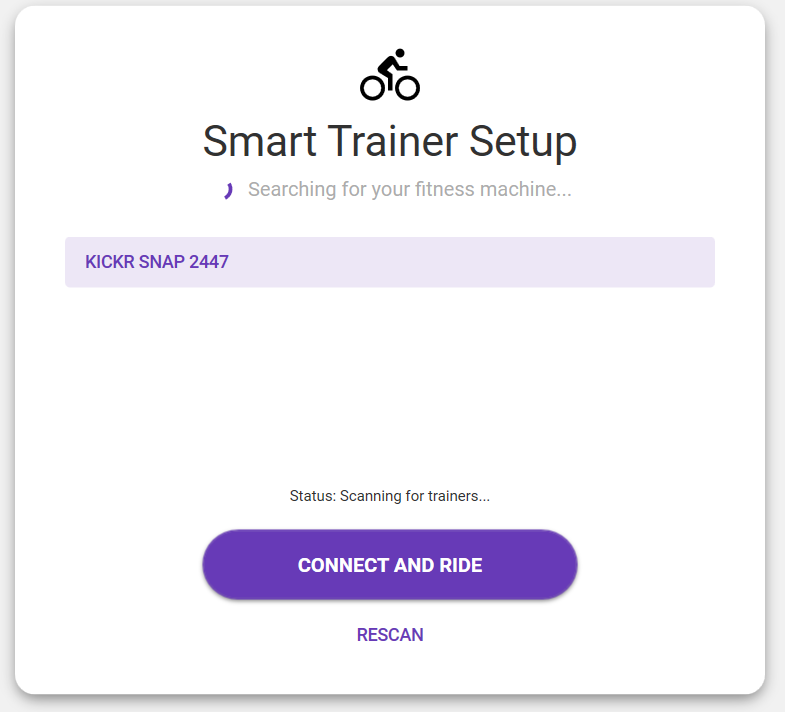

# BikeFitnessApp: Hack Your Ride

**Turn your smart trainer into a mountain simulator. No subscriptions. Just code and sweat.**




## The Mission
We wanted to ride hills on our smart trainer without paying monthly fees. The hardware didn't natively support "Simulation Mode" physics properly.

**The Solution:** We built our own physics engine. This app translates **Grade** directly into raw brake resistance, giving you realistic climbs (-10 to +20 percent) on hardware that thought it couldn't do it.

## Features that Matter

*   **Fake Sim Mode:** We tricked the trainer. You set the Grade, we calculate the physics.
*   **Gravity Assist:** Downhill actually feels easier. Our custom calibration maps -10 percent Grade to 0 percent Resistance (Coasting).
*   **Live Telemetry:** Speed, Distance, and Power calculated in real-time from raw Bluetooth packets.
*   **Adventure Modes:**
    *   **Hilly:** Smooth rolling sine waves.
    *   **Mountain:** Steep, jagged peaks.
    *   **Random:** Pure chaos for the brave.
*   **Zero-Lag UI:** Built with WPF and MVVM.
*   **Workout Intel:** Automatically captures 1s telemetry. Export your pain to **JSON** or **CSV** for post-ride analysis or AI coaching.

## Data & Analysis
Every ride generates a high-fidelity data log. When you hit **Stop**, the app offers to save a timestamped report.
*   **JSON:** Structured for the nerds. Perfect for feeding into LLMs or custom analysis tools.
*   **CSV:** Ready for Excel. Track your Power, Speed, and Grade over time.

## Under the Hood
*   **Framework:** .NET 8 (WPF)
*   **Protocol:** Reverse-engineered Bluetooth Low Energy (BLE) protocols.
*   **Engineering:** We use a Piecewise Linear Mapping function to translate human-readable Grade into machine-readable Brake Force, bypassing the device's faulty internal physics engine.

## How to Play
1.  **Launch** BikeFitnessApp.exe.
2.  **Scan and Connect** to your trainer.
3.  **Set Your Limits**: Pick your **Max Grade**.
4.  **Hit Start**: The app takes over. Your job is just to pedal.

## Build It Yourself
Clone the repo and run:
```powershell
dotnet build
dotnet run
```

---
*Built with C# and a lot of sweat.*
