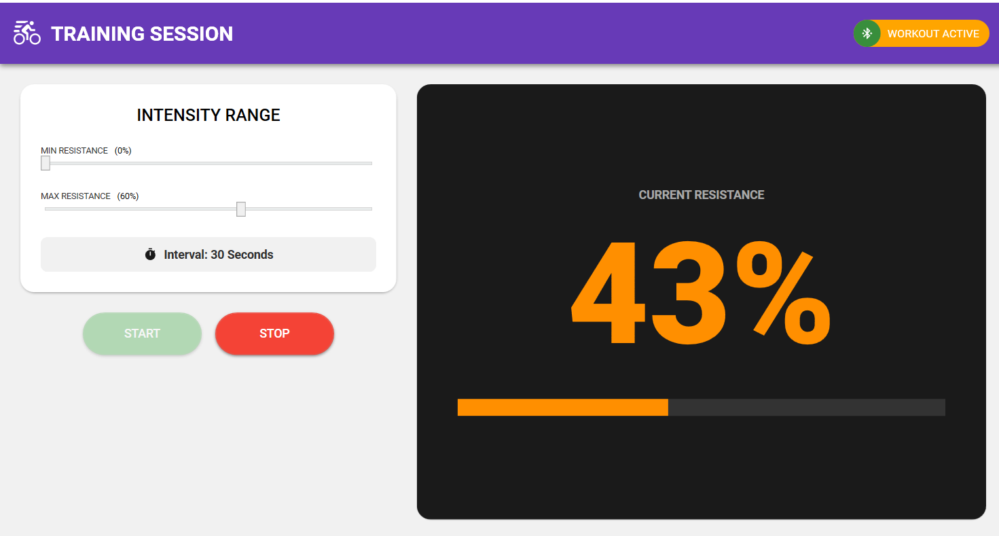

# Wahoo KICKR Randomizer

## Overview
This is a Windows Presentation Foundation (WPF) application designed to add variety to your indoor cycling workouts. It connects to a Wahoo KICKR smart trainer via Bluetooth Low Energy (BLE) and randomizes the resistance level at set intervals (every 30 seconds) within a user-defined range.

## Features
- **Bluetooth Connectivity**: Scans for and connects to Wahoo KICKR devices.
- **Automated Resistance Control**: Changes resistance every 30 seconds.
- **Customizable Intensity**: User-adjustable sliders for Minimum and Maximum resistance percentages (0-100%).
- **Visual Feedback**: Large, color-coded display showing the current resistance level (Green = Low, Yellow = Medium, Red = High).
- **Robust Connection Handling**: Includes retry logic for Bluetooth commands to handle intermittent connection issues.

## Prerequisites
- **Operating System**: Windows 10 or Windows 11.
- **Hardware**:
  - PC with Bluetooth 4.0+ (Low Energy) support.
  - Wahoo KICKR Smart Trainer (KICKR, CORE, SNAP, etc.).
- **Software**: .NET 6.0 or later (if building from source).

## How to Use

1.  **Launch the Application**: Open `BikeFitnessApp.exe`.
2.  **Scan for Devices**:
    - Click the **"Scan for KICKR SNAP"** button.
    - Wait for your device to appear in the list (ensure the trainer is plugged in and awake).
3.  **Connect**:
    - Select your device from the list.
    - Click **"Connect to Selected"**.
    - Wait for the status to change to "Connected".
4.  **Configure Workout**:
    - Adjust the **Min Resistance (%)** slider to your desired easy level.
    - Adjust the **Max Resistance (%)** slider to your desired hard level.
5.  **Start Workout**:
    - Click **"Start Workout"**.
    - The app will immediately set a random resistance and update it every 30 seconds.
6.  **Stop**:
    - Click **"Stop"** to pause the automated changes.

## Technical Details
- **Protocol**: The app communicates using the Wahoo Custom Characteristic UUID `a026e005-0a7d-4ab3-97fa-f1500f9feb8b`.
- **Resistance Control**: It uses Wahoo OpCode `0x42` to set resistance levels (0-100 integer range).
- **Error Handling**: Implements exponential backoff retries for `COMException (0x80650081)` errors common with Windows BLE.

## Troubleshooting
- **Device Not Found**: Ensure Bluetooth is on and no other app (like Zwift or the Wahoo phone app) is currently connected to the trainer. BLE devices usually support only one active controller connection.
- **Connection Error (0x80650081)**: The app automatically retries commands up to 5 times. If persistent, try restarting the trainer or toggling Bluetooth on your PC.