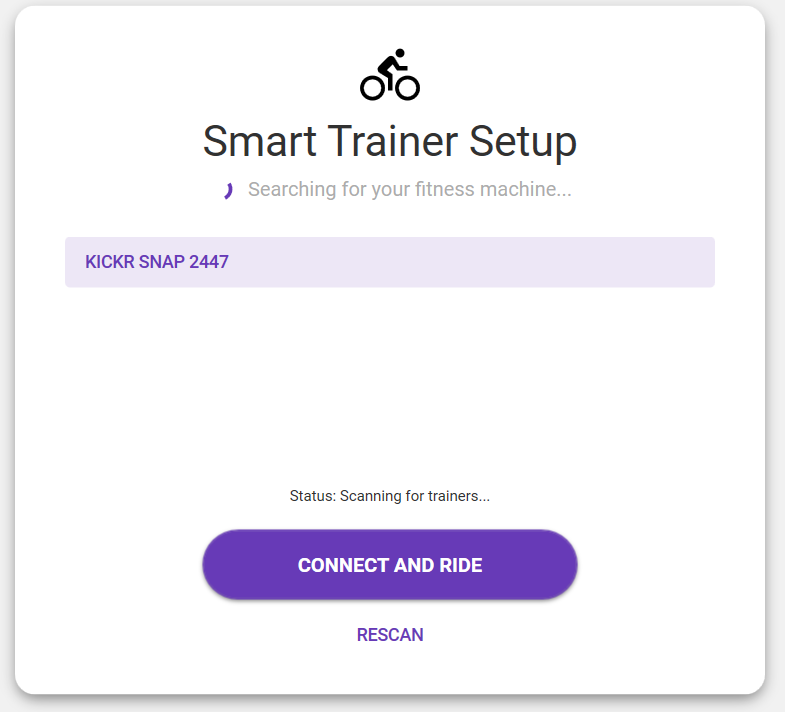
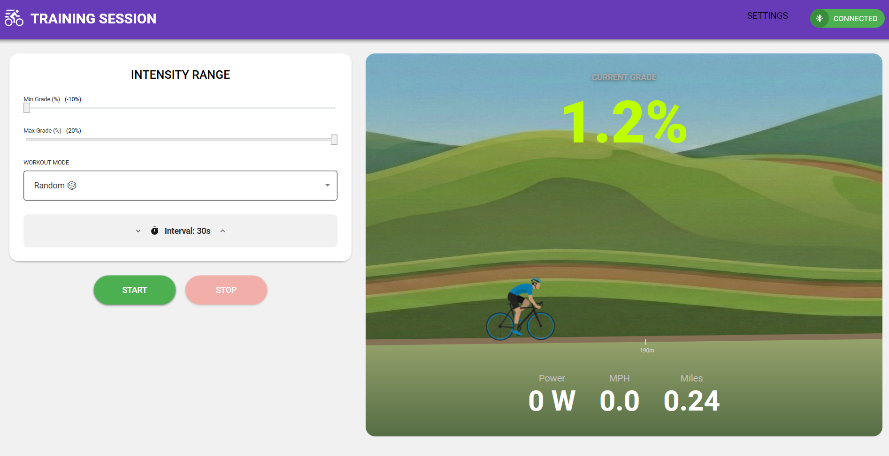

# BikeFitnessApp: Hack Your Ride

**Turn your smart trainer into a mountain simulator. No subscriptions. Just code and sweat.**




## The Mission
We wanted to ride hills on our smart trainer without paying monthly fees. The hardware didn't natively support "Simulation Mode" physics properly.

**The Solution:** We built our own physics engine. This app translates **Grade** directly into raw brake resistance, giving you realistic climbs (-10 to +20 percent) on hardware that thought it couldn't do it.

## Platform Support

| Platform | Status | UI Framework | Bluetooth |
| :--- | :--- | :--- | :--- |
| **Windows** | ✅ Stable | WPF / Avalonia | WinRT BLE |
| **Linux** | ✅ Functional | Avalonia UI | BlueZ (DBus) |
| **MacOS** | 🚧 Planned | Avalonia UI | Pending |

## Features that Matter

*   **Fake Sim Mode:** We tricked the trainer. You set the Grade, we calculate the physics.
*   **Gravity Assist:** Downhill actually feels easier. Our custom calibration maps -10 percent Grade to 0 percent Resistance (Coasting).
*   **Live Telemetry:** Speed, Distance, and Power calculated in real-time from raw Bluetooth packets.
*   **Adventure Modes:**
    *   **Hilly:** Smooth rolling sine waves.
    *   **Mountain:** Steep, jagged peaks.
    *   **Random:** Pure chaos for the brave.
*   **Cross-Platform UI:** High-performance rendering on both Windows (WPF/Avalonia) and Linux (Avalonia).
*   **Workout Intel:** Automatically captures 1s telemetry. Export to **FIT** (Strava), **JSON**, or **CSV**.

## Data & Analysis
Every ride generates a high-fidelity data log. When you hit **Stop**, the app offers to save a timestamped report.
*   **FIT:** Upload directly to Strava. Includes power, speed, distance, and grade.
*   **JSON:** Structured for the nerds. Perfect for feeding into LLMs or custom analysis tools.
*   **CSV:** Ready for Excel. Track your Power, Speed, and Grade over time.

## Under the Hood
*   **Framework:** .NET 10
*   **UI:** WPF (Legacy Windows) & Avalonia UI (Cross-platform)
*   **Protocol:** Reverse-engineered Bluetooth Low Energy (BLE) protocols for Wahoo KICKR and FTMS.
*   **Engineering:** We use a Piecewise Linear Mapping function to translate human-readable Grade into machine-readable Brake Force, bypassing the device's faulty internal physics engine.

## How to Play

### Windows (Original WPF)
1.  **Launch** `BikeFitnessApp.exe`.
2.  **Scan and Connect** to your trainer.
3.  **Set Your Limits**: Pick your **Max Grade**.
4.  **Hit Start**: The app takes over.

### Linux (Avalonia)
1.  Ensure `bluez` and `dbus` are installed and running.
2.  Run the Avalonia build:
    ```bash
    dotnet run --project BikeFitness.Avalonia
    ```

## Build It Yourself
Clone the repo and build the solution:
```bash
# To build everything
dotnet build BikeFitnessApp.sln

# To build only the cross-platform Avalonia app
dotnet build BikeFitness.Avalonia/BikeFitness.Avalonia.csproj
```

## Running Tests and Code Coverage
To run the automated tests (currently Windows-targeted):
```powershell
dotnet test ./BikeFitnessApp.UnitTests
```

---
*Built with C# and a lot of sweat.*
